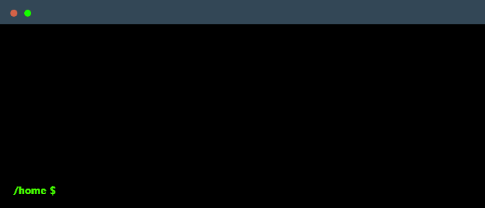

 

    

### My mission
I’m driven by a passion for coding and building real-world solutions through software. With a technical mindset, I thrive on turning complex problems into clean, efficient code. My mission is to create impactful applications, collaborate with developers and teams, and use programming as a tool to innovate, connect, and solve meaningful challenges.

### GitHub Stats

### Main skills

